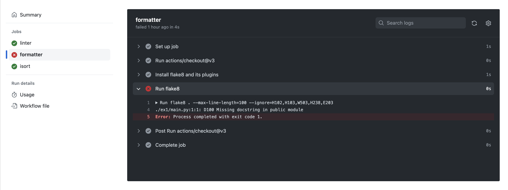

# コードレビューまとめ

コードレビューで得られたよりキレイなソースコードを書くためのルールやより高速なプログラムにするなど改善のためのTIPSをまとめておきます．
今後大きなプログラムを書くことになることに備えて丁寧なコーディングを行う習慣を身に付けましょう．

## 全体に言えること

- 一ヶ月後の自分が見てもわかるコードを書こう
  （見やすいコードを書くのはなにより自分のため！）
- 適切なコメントを残す
- 関数名，変数名には意味をもたせる
  - `a` など適当な名前は付けない
- 複数単語を連結する場合
  - キャメルケース: `camelCase`のように単語の先頭を大文字にして連結する
  - スネークケース: `snake_case`のように_で連結する
    言語や変数名，クラス名など用いる箇所によって推奨される書き方が異なる
- スコープを意識する
- プログラムが巨大になりそうならモジュール分割する
    - 関連する処理はクラスにまとめましょう
- 無闇にグローバル変数を宣言しない

## python

- Check list
  - [ ] PEP8（コーディング規約）を遵守した
  - [ ] docstringに基づきコメントを記述した
  - [ ] 可読性の高い変数名をつけた

- 更に余裕があれば...
  - [ ] 英語でコメントを記述した
  - [ ] 関数やクラスなど再利用を意識して実装した


- PEP8のチェックはエディタのプラグインを利用すると自動で指摘，修正してくれるので便利

    例．Atomの場合（参考: [atomでpythonのlinterを利用する](https://qiita.com/fiftystorm36/items/f8ad30ea5eb92c36a6ed)）

## Github ActionsのCIによるコーディングチェック

PR作成時やその作業ブランチへpushすると，自動でCIが実行されます．

上記の注意点などを指摘してくれるので，出力メッセージを参考に美しく読みやすいコーディングを心がけましょう！

VSCodeユーザはさまざまな拡張機能を是非使いこなしてください(例: [VSCodeを使いこなそう](./vscode.md)）．

チェックでは以下のものが使用されています．

- Linter: black
- Formatter: flake8
- import関連: isort

例えば，以下のように実行の様子が確認できます．


引っかかったチェックのDetailsをクリックすると，詳細な情報を見ることができます．
以下の例だと，docstringを書き忘れていることがわかります．


### コーディングの修正
以上のチェックエラーを解消する方法の1つを示しておくので，参考にしてください．

1. pipでlinterなどをインストール　`pip install black flake8 flake8-docstrings isort`
2. それぞれ実行する　`black .`など
3. コードを修正してエラーを解消する
4. pushする

<details><summary>コードの書き方の例</summary><div>

```python:sample.py
#!/usr/bin/env python
# coding: utf-8


"""Sample code generated by Chat-GPT."""

from typing import List


def sum_list(numbers: List[int]) -> int:
    """
    Calculate the sum of numbers in a list.

    Args:
        numbers (List[int]): A list of numbers.

    Returns:
        int: The sum of numbers in the given list.
    """
    total = 0
    for num in numbers:
        total += num
    return total


def main():
    """
    Call the sum_list function with a sample list of numbers and prints the result to the console.

    Returns:
        None
    """
    my_numbers = [1, 2, 3, 4, 5]
    print(sum_list(my_numbers))


if __name__ == "__main__":
    main()    
```

</div></details>

# 演習で困ったら

- まず自分でネットで調べる
- 10分調べてもわかりそうになかったら先輩に聞く
  - 直接聞いても良いけど、b4lecture-2021にスレッド立ててくれると、みんなが見れて嬉しい。(君が分からないことに、みんなも困っている!!) 
- エラーメッセージをよく読みましょう
  - 例えば`segmentation fault`なら配列の外など不正なメモリアクセスをしています
  - エラーメッセージで検索すると同じエラーが出た人の解決策が見つかることがあります
- デバッグをしてみよう
  - エラーの原因を特定するために変数を`print`して中身を見てみましょう（通称：printデバッグ）
  - デバッガを利用しよう
    - pythonなら`pdb`が標準モジュールで用意されている
    - IDEを利用している場合は詳しく処理の中身を見たいところにブレークポイントを置く

## 質問の仕方

- **質問は積極的にしましょう**
- わからないところや聞きたいことを明確にしておくとスムーズです（参考：[質問は恥ではないし役に立つ](https://qiita.com/seki_uk/items/4001423b3cd3db0dada7)）
